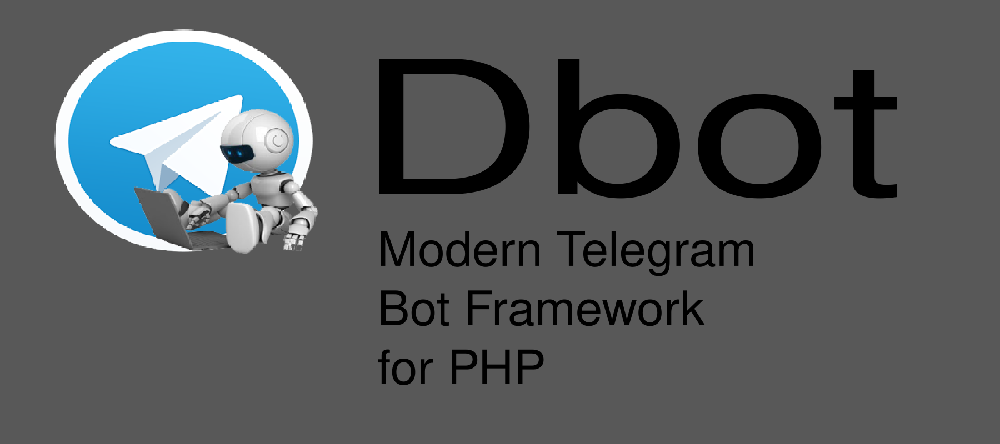

<header>
	
</header>

[](https://core.telegram.org/bots/api)
 
 


## Dbot
Dbot adalah sebuah Framework Bot Telegram untuk bahasa pemrograman PHP, dan saat ini masih baru lahir, dan dalam mode pengembangan, kontribusi anda sangat kami harapkan untuk membuat Dbot semakin berkembang, dengan harapan bisa bermaanfaat bagi umum.

## Requirements
- PHP ^8.0 || ^7.3
- Telegram Bot
- Git (Optional) 

## Install & Test

```bash
[fatah@home]:~$ cd ~/Code
[fatah@home]:~$ git clone https://github.com/fathurrohman26/dbot.git Dbot
[fatah@home]:~$ cd Dbot
[fatah@home]:~$ composer update -vv
[fatah@home]:~$ # sesuakan token bot
[fatah@home]:~$ vim example/bot.php
[fatah@home]:~$ php example/bot.php
```

## Webhook Update (Dalam Pengembangan)

Untuk menggunakan fitur update dengan metode webhook ikuti langkah berikut:

- Buka file `example/webhook.php` dan masukan token bot pada parameter yang tertera.
- Masuk pada directory `example` dan jalankan PHP Development Server.
- `[fatah@home]:~/Code/Dbot/example $ php -S localhost:8080 -t . webhook.php`
- Lalu ekspos server yang berjalan di mesin lokal ke internet dengan menggunakan `nrgok`, baca cara install ngrok [disini](https://ngrok.com/docs).
- Buka terminal baru / Tab baru pada terminal dan pada direktori file executable `ngrok` berada
- `[fatah@home]:~$ ./ngrok http 8080`
- Maka sekarang server bot yang berjalan pada localhost:8080 dapat di akses dari internet menggunakan url dari `ngrok` 
- Set url webhook bot melalui browser `https://api.telegram.org/bot{TOKEN}/setWebhook?url={url-forward-ngrok}`
- Atau dapat juga dengan menggunakan file `example/setWebhook.php` dengan menyesuaikan token dan url, Lalu eksekusi file `php example/setWebhook.php`


## Catatan
Untuk contoh penggunaan fitur yang telah ada bisa dilihat pada folder `example`.

Berikut ini merupakan Overview dari penggunaan Dbot
```php
<?php

use Fatah\Dbot\Dbot;

require_once __DIR__ . '/vendor/autoload.php';

$bot = new Dbot('token-bot');

// handle tipe update message
$bot->on('message', function($ctx){
    // variabel $ctx berisi instansi dari `Fatah\Dbot\Context` yang merupakan class yang berisi context update saat ini
    $update = $ctx->update; // array dari update saat ini
    $chat   = $update['message']['chat'];
    // bisa juga menggunakan shortcut dari Context
    $chat   = $ctx->getChat();
    $from   = $ctx->getFrom();
    
    // dapatkan id  chat dengan shortcut Context
    $chat_id = $ctx->getChat('id');
    
    // id message
    $message_id = $ctx->getMessage('message_id');
    
    // untuk mendeteksi subUpdateType dari tipe update message untuk saat ini dilakukan secara manual sbb:
    $message = $ctx->getMessage();
    
    // cek apakah ada text didalam update message
    if (isset($message['text'])) {
        // dapatkan text
	$text = $ctx->getText();
	
	if (strtolower($text) == "/start") {
	    // gunakan fitur reply dari object $ctx
	    $ctx->reply('Halo, aku dibuat dengan *Dbot*', 'Markdown');
	} elseif (strtolower($text) == "/ping") {
	    $ctx->replyWithHTML('<b>pong!!</b>');
	}
    }
});

// untuk handle subTypeUpdate dari tipe update message bisa menggunakan method on() seperti diatas
$bot->on('text', function($ctx){
    $text = strtolower($ctx->getText());
    if ($text == 'halo') {
        $ctx->replyWithMarkdown(sprintf("Halo %s, apa kabar?", $ctx->getFrom('first_name')));
    }
});


// sticker
$bot->on('sticker', function($ctx){
   // id sticker yang telah ada
   $sticker = 'CAACAgUAAxkBAAKRAWC4GpTIb_PIw8Ze_ENXackrb3slAAIbAQACksQIV05PwRXgezXdHwQ';
   $ctx->replyWithSticker($sticker);
}); 

// Deteksi Text Biasa
$bot->hears('marco', function($ctx){
	$ctx->replyWithMarkdown('*Pollo!*');
});

// Deteksi Text Regex
$bot->hears('/^\/status/i', function($ctx){
	$ctx->replyWithHTML('<i>let\'s play together!</i>');
});

// Handle Exception
$bot->hears('exception', function($ctx){
	throw new Exception("Tes handle Exception Dbot");
});


// sendPhoto dengan foto yang telah ada di server Telegram
$bot->hears('foto_id', function($ctx){
	$photo = 'AgACAgUAAxkBAAIB72C4yRAIBpu3-WQO-j1ePfrV4x8DAAJaqzEbgLTIVZZ_UejLyB5Fp96wcnQAAwEAAwIAA3MAA4UuAAIfBA';
	$ctx->replyWithPhoto($photo, 'foto id');
});

// sendPhoto dengan mengupload foto dari URL
$bot->hears('foto_url', function($ctx){
	$photo = 'https://i.pinimg.com/736x/16/02/6a/16026a38245d4f6cd1f2b3fde54bbced.jpg';
	$ctx->replyWithPhoto($photo, 'foto url');
});

// sendPhoto dengan mengupload foto dari file lokal
$bot->hears('foto_up', function($ctx){
	// upload foto
	$photo = __DIR__ . '/example-files/doraemon.jpg';
	$ctx->replyWithPhoto($photo, 'foto upload');
});

// untuk menjalankan bot secara long_polling gunakan
// untuk default parameter bisa dilihat pada `src/Dbot.php`
$bot->launch();
```
Jika ingin menggunakan metode update Webhook pada saat memanggil metod launch() gunakan paramter sebagai berikut:
```php
$bot->launch(false, [
	'webhook_log' => __DIR__ . '/webhook_log.txt'
]);
```

## Kontributor
- fatah 
- fadhilah1992
-
-
-

## Kontribusi
Silahkan untuk berkontribusi, lakukan pengembangan, baik penambahan method yang belum ada, ataupun membuat fitur lainya, lakukan pull request, dan tulis username github anda pada list kontributor :)
Bisa juga dengan membuat issues baru, tuliskan saran penambahan fitur, laporan bug, penyempurnaan code, dan lain lain.
